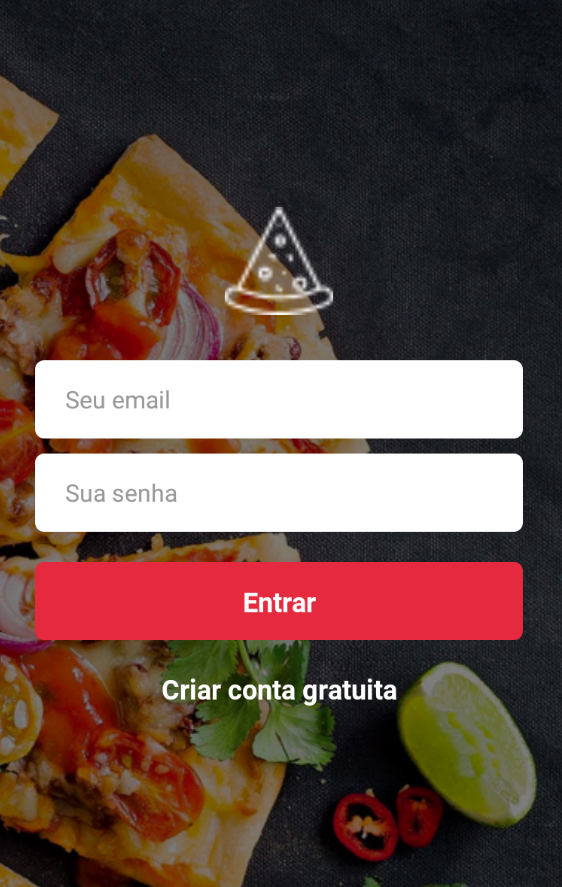

# Desafio Final 2 - APLICATIVO PIZZARIA

Nesse desafio foi construida uma aplicação completa envolvendo back-end com NodeJS, front-end com ReactJS e mobile com React Native.

A aplicação consiste em um app de controle de pedidos por delivery de uma pizzaria. O aplicativo móvel será utilizado pelos clientes da pizzaria para realizar pedidos e a versão web será utilizada para controle e registro dos pedidos realizados.

A aplicação chamada “Pizza Don Juan” será utilizada para realizar e controlar pedidos de delivery. A aplicação não suportará mais restaurantes sendo feita apenas para essa pizzaria.

A aplicação móvel é a parte mais completa do desafio, contendo todas as páginas necessárias para um cliente realizar um pedido na pizzaria, selecionar sabor, tamanho e fechar pedido. O cliente também poderá visualizar seu histórico de pedidos e todo cardápio da pizzaria.

O link para o backend deste aplicativo se encontra aqui:

https://github.com/dbins/rocketseat_desafiofinal2_backend

O link para o frontend deste aplicativo se encontra aqui:

https://github.com/dbins/rocketseat_desafiofinal2_frontend

Neste aplicativo foi utilizado o React Native CLI, estilização através de Styled Components, React Navigation, Redux, Redux Saga e Reactotron. Também foi feita uma splashscreen e um ícone personalizado, além da configuração necessária para gerar um APK assinado.

## Instalação

- git clone https://github.com/dbins/rocketseat_desafiofinal2_mobile
- npm install
- Ative o backend junto com a fila de disparos de e-mails (Redis)
- Edite o arquivo /services/api.js e insira o endereço de IP da API
- Edite o arquivo /services/config/ReactotronConfig.js e informe o seu IP local. Essa etapa é opcional, é apenas para quem for testar a aplicação usando o Reactotron.
- Abra o emulador. Os testes foram feitos no Windows 10 utilizando o emulador Genymotion (Android)
- react-native run-android

## Requisitos Funcionais

**Usuário/Autenticação**

- O usuário pode se cadastrar com nome, e-mail e senha;
- O usuário pode realizar login utilizando e-mail e senha;

**Detalhes**

- Ao acessar o aplicativo, existe um cardápio composto pelas categorias de produto (pizza/bebidas/massas), tipo de produtos (sabor de pizza/marca de refrigerante) e tamanho do produto (cm para pizzas/ml para bebidas/P,M ou G para outros);
- Na finalização do pedido, ao informar o CEP, o restante dos campos são preenchidos de forma automática;
- Os administradores não podem logar no aplicativo mobile.
- Existe uma tela onde o usuário pode consultar os pedidos que já foram feitos.

## Gerar APK

Para gerar o APK, a partir do terminal, dentro da pasta do projeto, faça o seguinte:

- cd android
- gradlew assembleDebug (para gerar a versão de testes) ou gradlew assembleRelease (para gerar a versão para enviar para a PlayStore)
